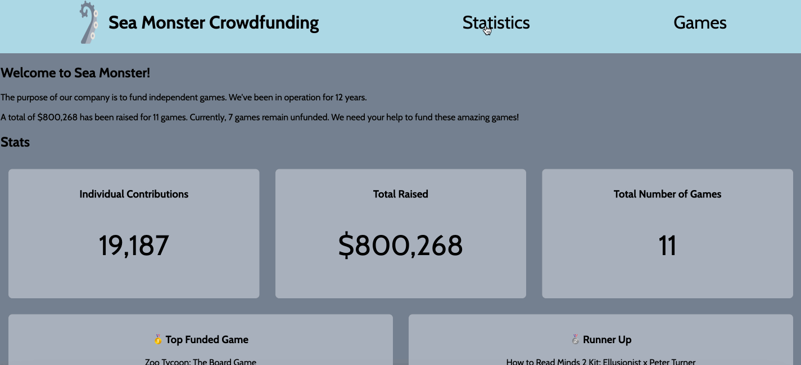

# WEB102 Prework - *Name of App Here*

Submitted by: **Your Name Here**

**Name of your app** is a website for the company Sea Monster Crowdfunding that displays information about the games they have funded.

Time spent: **X** hours spent in total

## Required Features

The following **required** functionality is completed:

* [x] The introduction section explains the background of the company and how many games remain unfunded.
* [x] The Stats section includes information about the total contributions and dollars raised as well as the top two most funded games.
* [x] The Our Games section initially displays all games funded by Sea Monster Crowdfunding
* [x] The Our Games section has three buttons that allow the user to display only unfunded games, only funded games, or all games.

The following **optional** features are implemented:

* [x] The navBar at the top of the page allows user to get to each section quickly.

## Video Walkthrough

Here's a walkthrough of implemented features:

<!-- Replace this with whatever GIF tool you used! -->
GIF created with [LiceCap](https://www.cockos.com/licecap/)  
<!-- Recommended tools:
[Kap](https://getkap.co/) for macOS
[ScreenToGif](https://www.screentogif.com/) for Windows
[peek](https://github.com/phw/peek) for Linux. -->

## Notes

Describe any challenges encountered while building the app.

After completing the required challenges, I decided to add a navbar to the top of the page. By simply adding to nav-items and adjust the css, I notice that the logo-title pair is becoming far apart from each other, which is not what I desired. By looking through the flexbox documentations, the solution I came up is to put logo-title pair into a single div, and then flex with other nav-items, so that the navbar style is configured correctly with logo and title close together.  

## License

    Copyright [2023] [Honghao Lin]

    Licensed under the Apache License, Version 2.0 (the "License");
    you may not use this file except in compliance with the License.
    You may obtain a copy of the License at

        http://www.apache.org/licenses/LICENSE-2.0

    Unless required by applicable law or agreed to in writing, software
    distributed under the License is distributed on an "AS IS" BASIS,
    WITHOUT WARRANTIES OR CONDITIONS OF ANY KIND, either express or implied.
    See the License for the specific language governing permissions and
    limitations under the License.
